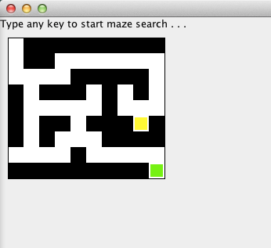
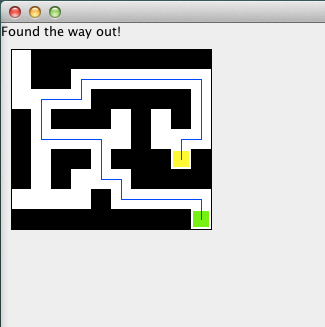

# Maze Solver (Recursive Search)

In this assignment, I wrote a program that uses recursion/backtracking to try to find a path through a given maze input.

## Program Details 

The program takes as input (from a text file) a maze with the following format: 

```
9 10 
0111111111
0110000000
0000111110
1011101010
1000001000
1011011101
1010001111
0000100000
1111111110
5 8
8 9
```

The first line gives the total size of the maze to come; this is a maze with 9 rows and 10 columns. On the following lines, a 1 in a particular position means that there's a wall at that position. A 0 in a particular position means that that position is free. The last two lines of the file are the maze coordinates for the entry location, followed by the maze coordinates for the exit location.

The program reads a maze, such as the one above, from a file whose name will be given on the java command line, and initially display it to the graphics window as follows (entry location shown in yellow and exit location shown in green):





Then, when the user hits any key, it will display the maze with a path through it shown in blue, or just the original maze if there is no possible path from the entrance to the exit. It will also give some indication of whether there was a path (see the message in the upper-left corner of the window below). 

Here's example output for the maze above: 





**Note**: the above data file is available as `src/testfiles/medMaze`.